# YouTube Video Analyzer

Fetches YouTube transcripts and prepares copy-and-paste ChatGPT analysis prompts.

It comes in two versions that produce the same transcripts and prompts:

- **Streamlit app** (`app.py`): a local Python web app you run from a terminal.
- **Chrome extension** (`chrome-extension/`): a side panel in Chrome that works next to the video you're watching, with no Python needed.

Neither version calls an AI service. You copy or download the generated prompt and paste it into ChatGPT yourself.

## Contents

- [What The App Does](#what-the-app-does)
- [Screenshots: Streamlit App](#screenshots-streamlit-app)
- [Screenshots: Chrome Extension](#screenshots-chrome-extension)
- [Chrome Extension](#chrome-extension)
- [Current Limitations](#current-limitations)
- [Setup On Windows PowerShell](#setup-on-windows-powershell)
- [Run The Streamlit App](#run-the-streamlit-app)
- [Run Manual Regression Checks](#run-manual-regression-checks)
- [Dependencies](#dependencies)

## What The App Does

- Accepts a YouTube URL or video ID.
- Extracts the YouTube video ID from common URL formats.
- Fetches an available English transcript.
- Cleans the transcript into more readable text.
- Displays transcript metadata, including character count, word count, and estimated reading time.
- Shows a transcript preview and full transcript expander.
- Downloads the cleaned transcript as a `.txt` file.
- Generates a ChatGPT analysis prompt for manual copy/paste.
- Supports prompt modes:
  - General Analysis
  - Study Notes
  - Technical / Engineering Review
  - Action Plan
- Creates chunked ChatGPT prompts for very long transcripts.
- Includes a small debug info expander.

## Screenshots: Streamlit App

> The screenshots use a made-up sample lecture ("How Git Branching Works", video ID `SAMPLEvid01`) so they don't depend on any real video. The UI is the real app.

### 1. Home screen and prompt modes

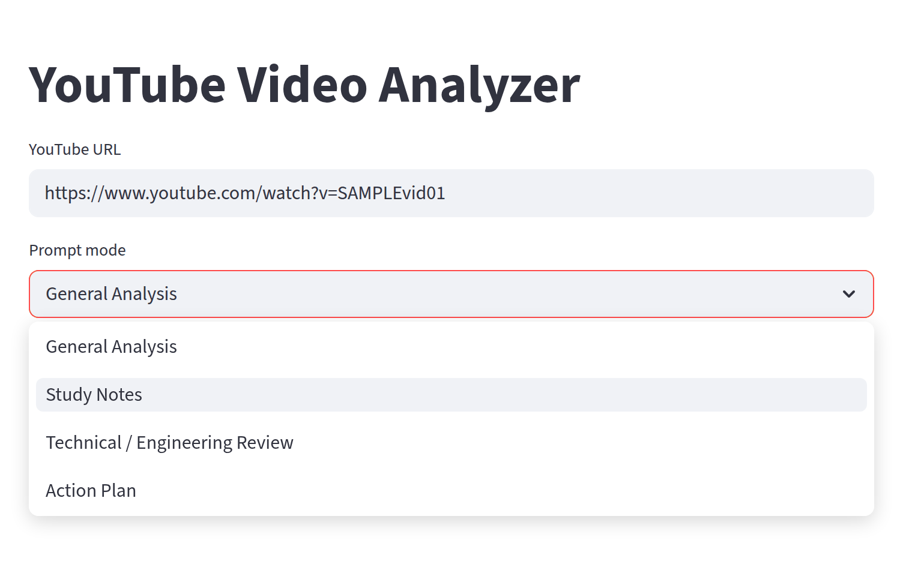

This is what you see at `http://localhost:8501`.

- **YouTube URL**: paste a full link (`youtube.com/watch?v=…`, `youtu.be/…`, `/shorts/…`, `/embed/…`) or just the 11-character video ID. The app pulls out the video ID for you, so extra parameters like `&t=42s` are fine.
- **Prompt mode**: picks the structure of the ChatGPT prompt. Each mode asks ChatGPT for a different 9-part layout:
  - **General Analysis**: executive summary, main argument, key points, hidden assumptions, takeaways, verdict.
  - **Study Notes**: core concepts, definitions, examples, study questions, memory aids. Good for lectures.
  - **Technical / Engineering Review**: technical claims, architecture, implementation details, risks and tradeoffs, things to verify.
  - **Action Plan**: recommendations, decisions, ordered steps, resources, blockers, priorities.
- **Analyze** stays greyed out until the URL box has text.

### 2. Results: metadata and transcript preview

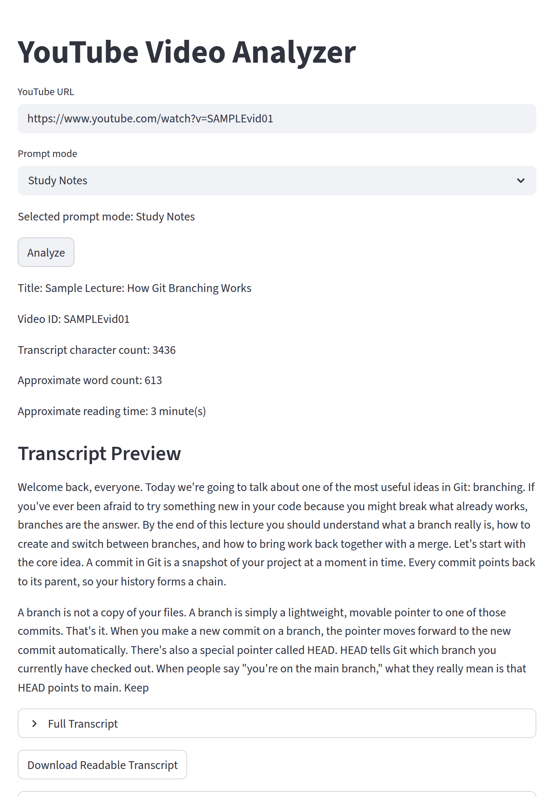

After you click **Analyze**, the app fetches the English transcript and shows:

- **Title** (from YouTube's public oEmbed endpoint) and **Video ID**.
- **Transcript character count**, **Approximate word count**, and **Approximate reading time** (words ÷ 200, at least 1 minute). The word count is a quick way to tell whether the prompt will fit in ChatGPT.
- **Transcript Preview**: the first 1,000 characters of the cleaned transcript. Cleaning collapses the caption fragments into sentences and groups them into paragraphs of about 500 characters, without changing any words.
- **Full Transcript**: expands to show the whole cleaned text.
- **Download Readable Transcript**: saves `transcript_<video_id>_readable.txt`.

### 3. Timestamped transcript

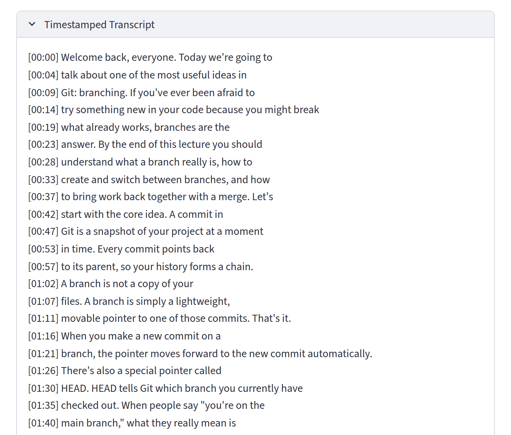

The **Timestamped Transcript** expander keeps YouTube's original caption lines, each starting with its time in the video (`[MM:SS]`, or `[HH:MM:SS]` past the hour). Use it to jump back to a moment in the video or to cite where something was said. **Download Timestamped Transcript** (below the expander) saves `transcript_<video_id>_timestamped.txt`.

### 4. ChatGPT analysis prompt

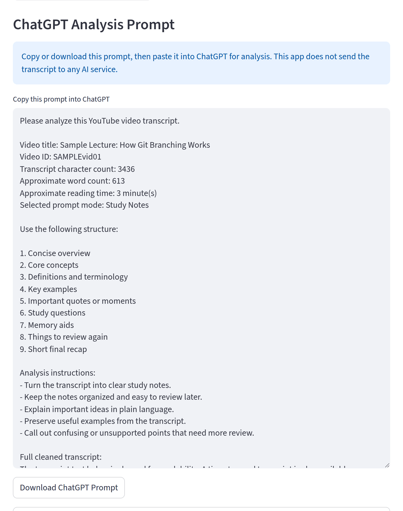

This is the main output. The text box holds a complete prompt, ready to paste into ChatGPT:

1. A request to analyze the transcript.
2. A metadata header: title, video ID, character count, word count, reading time, and prompt mode.
3. The structure and instructions for the selected mode (Study Notes in this example).
4. The full cleaned transcript.

Click in the box, select all (`Ctrl+A`), copy, and paste into ChatGPT, or use **Download ChatGPT Prompt** to save `chatgpt_prompt_<video_id>_<mode>_full.txt`. The blue note is a reminder that the app never sends the transcript anywhere.

### 5. Long transcript warning

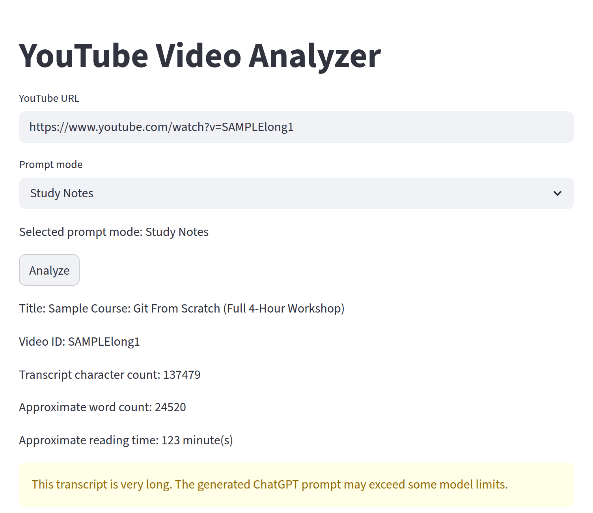

When a transcript is over **20,000 words** (here, a 4-hour sample workshop with 24,520 words), a yellow warning appears under the metadata. The full prompt is still generated, but it may be too large for some ChatGPT models, so the app also builds chunked prompts.

### 6. Chunked ChatGPT prompts

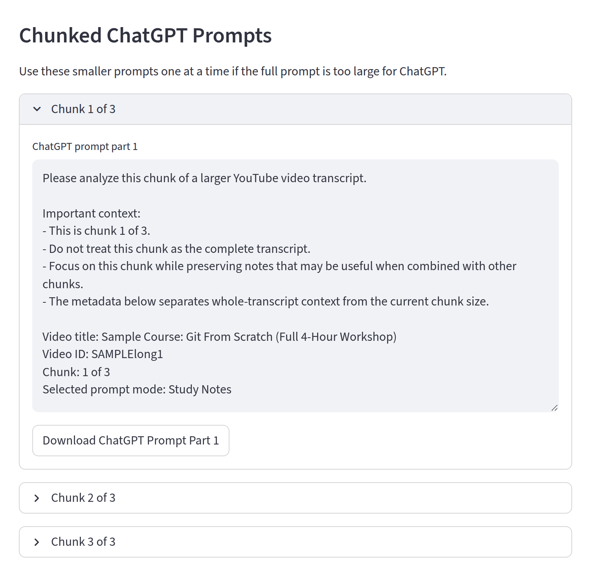

For long transcripts, the **Chunked ChatGPT Prompts** section splits the transcript into parts of up to **12,000 words** each. Each chunk prompt:

- Tells ChatGPT which chunk this is (`chunk 1 of 3`) and not to treat it as the complete transcript.
- Includes metadata for the whole transcript and for the current chunk.
- Uses the same prompt-mode instructions as the full prompt.

Paste the chunks into ChatGPT one at a time, in order. Each has its own **Download ChatGPT Prompt Part N** button (`chatgpt_prompt_<video_id>_<mode>_part_N_of_M.txt`).

### 7. Errors and debug info

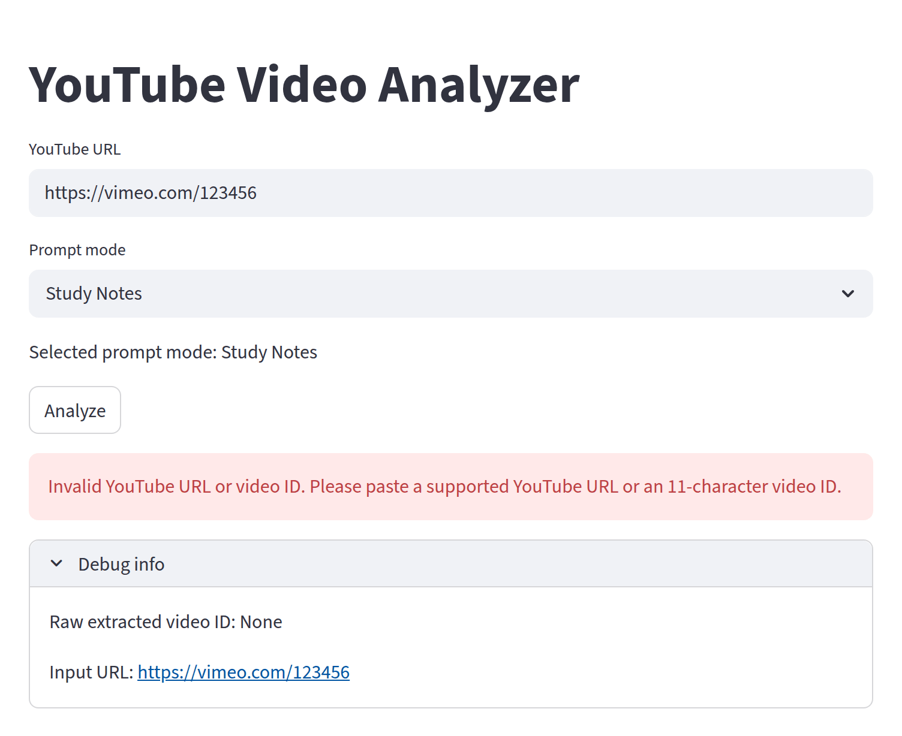

If the input isn't a YouTube URL or ID (a Vimeo link here), a red error explains what's wrong. Other errors you may see:

| Message | Meaning |
| --- | --- |
| Transcript disabled | The uploader has turned off captions for this video. |
| No English transcript found | Captions exist, but not in English. |
| Transcript unavailable: this video is unavailable | The video was removed or can't be accessed. |
| Network or YouTube request failure | You're offline, or YouTube is rate-limiting or blocking requests. |

**Debug info** shows the video ID the app extracted (`None` means it couldn't find one), the input you typed, and after a successful fetch, how many caption segments YouTube returned.

## Screenshots: Chrome Extension

> These also use the sample lecture. The side panel is shown at its default width of about 400 px.

### 1. Side panel, ready to analyze

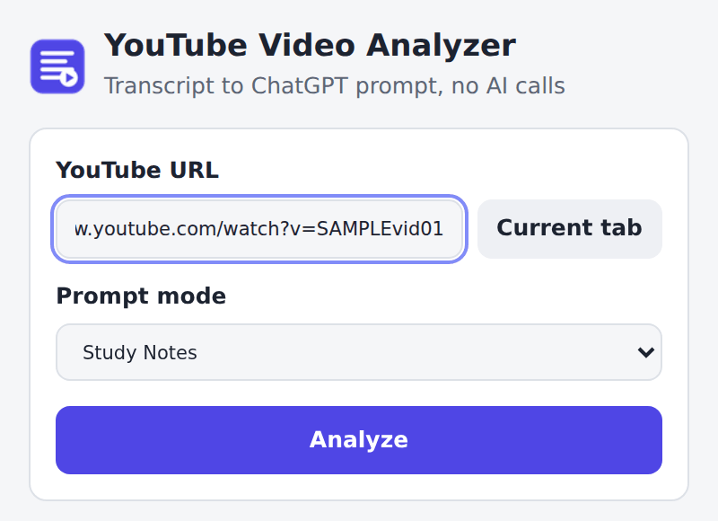

Click the extension's toolbar icon to open the analyzer as a Chrome side panel. It stays open next to the video while you browse.

- **YouTube URL** fills in automatically when the current tab is a YouTube video, and follows along when you switch to another video. If you type your own URL, the panel leaves it alone.
- **Current tab** re-fills the box from the current tab.
- **Prompt mode** and **Analyze** work the same as in the Streamlit app.

### 2. Results: video card, preview, and transcripts

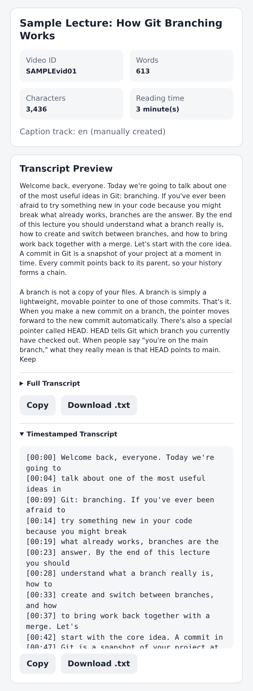

- The **video card** shows the title and four stat tiles: **Video ID**, **Words**, **Characters**, and **Reading time**. The line underneath says which caption track was used and whether it was written by a person or auto-generated by YouTube (auto-generated captions are usually less accurate).
- **Transcript Preview**, **Full Transcript**, and **Timestamped Transcript** show the same text as the Streamlit app.
- Each transcript has **Copy** (to the clipboard) and **Download .txt** buttons, which save files with the same names as the Streamlit app.

### 3. ChatGPT prompt with copy and download

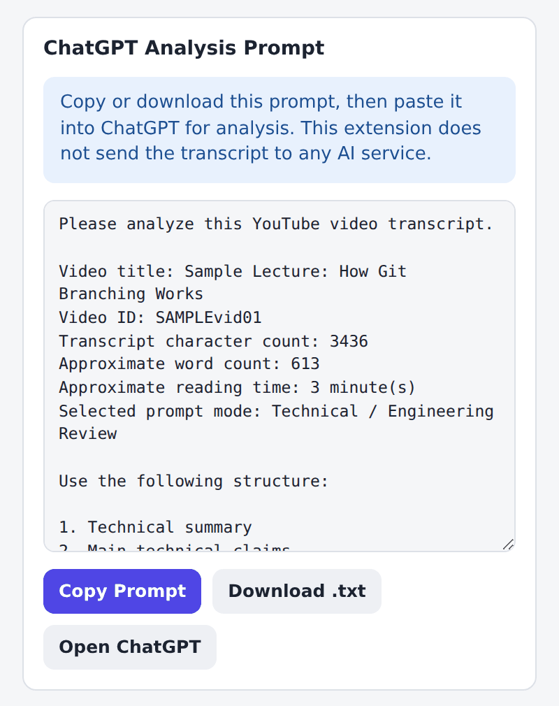

- The prompt text is identical to what the Streamlit app generates for the same video and mode.
- **Copy Prompt** puts the whole prompt on your clipboard in one click (the button briefly shows "Copied!").
- **Download .txt** saves `chatgpt_prompt_<video_id>_<mode>_full.txt`.
- **Open ChatGPT** opens chatgpt.com in a new tab so you can paste right away.
- Changing **Prompt mode** after analyzing rebuilds the prompt immediately, without fetching the transcript again. This screenshot shows the Technical / Engineering Review mode.

### 4. Long transcripts and chunked prompts

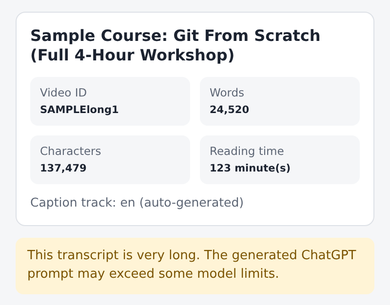
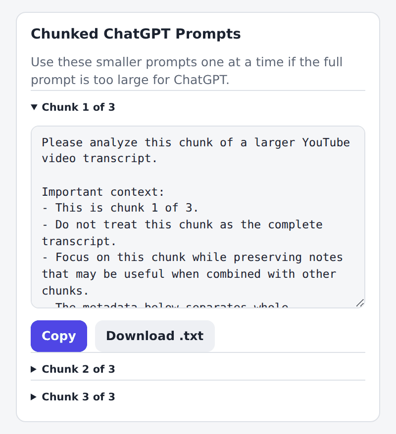

Same rules as the Streamlit app: transcripts over 20,000 words get a warning and a **Chunked ChatGPT Prompts** section with parts of up to 12,000 words. Each chunk has its own **Copy** and **Download .txt** buttons.

### 5. Errors and debug info

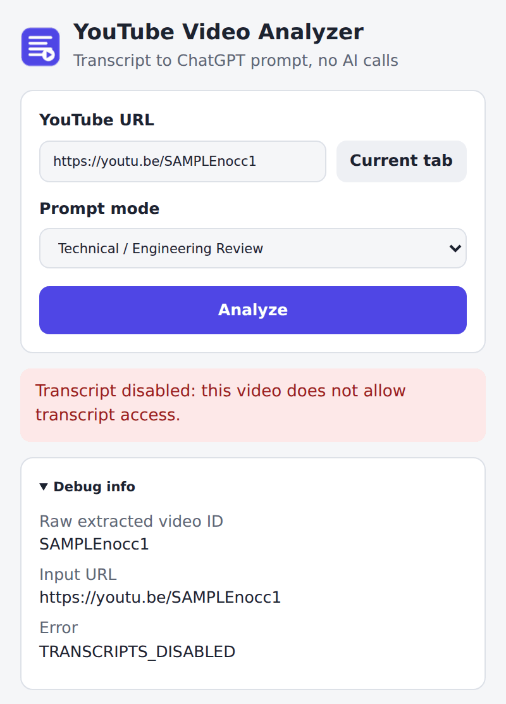

Errors use the same messages as the Streamlit app. **Debug info** also shows the internal error code (here `TRANSCRIPTS_DISABLED`), which helps when reporting a problem. The extension adds one message of its own: if YouTube shows a cookie consent page (common in the EU), it asks you to open youtube.com and answer the consent prompt first.

### 6. Dark mode

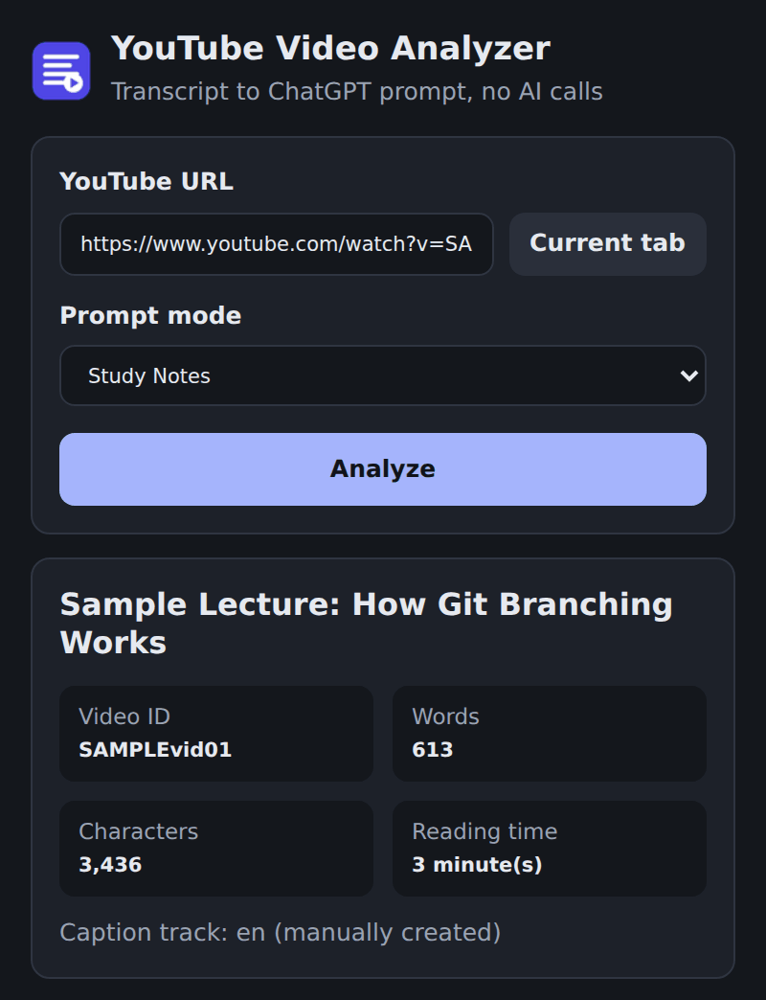

The panel switches between light and dark automatically to match your system setting.

## Chrome Extension

The `chrome-extension/` folder is a Manifest V3 Chrome extension that does everything the Streamlit app does, from a side panel.

### Install (Load Unpacked)

1. Open `chrome://extensions` in Chrome (version 116 or newer).
2. Turn on **Developer mode** (top right).
3. Click **Load unpacked** and choose the `chrome-extension` folder in this repository.
4. Optional: click the puzzle-piece icon in the toolbar and pin **YouTube Video Analyzer**.

### Use

1. Open a YouTube video.
2. Click the extension icon. The side panel opens with the video URL filled in.
3. Choose a prompt mode and click **Analyze**.
4. Click **Copy Prompt**, then **Open ChatGPT** and paste.

### How it gets transcripts

The extension follows the same steps as the `youtube-transcript-api` library the Streamlit app uses:

1. Load the video's watch page to read YouTube's public Innertube API key.
2. Ask YouTube's player endpoint for the video's caption tracks.
3. Pick an English track (manually created captions first, then auto-generated) and download it.
4. Parse the captions into timed segments, then clean them and build prompts with the same logic as `app.py`.

The watch page request sends your browser's YouTube cookies, so a consent choice you've already made on youtube.com is respected. The player and caption requests are sent without cookies, like the Python library.

### Permissions and privacy

| Permission | Why it's needed |
| --- | --- |
| `sidePanel` | Shows the analyzer in Chrome's side panel. |
| `https://www.youtube.com/*` | Fetches transcripts from YouTube, and reads the current tab's URL when it's a YouTube video so the URL box can fill in. |

The extension only talks to `www.youtube.com`. It has no analytics, sends nothing to any AI service, and doesn't store anything: fetched transcripts are kept in memory until you close the side panel.

### Differences from the Streamlit app

- Adds **Copy** buttons, an **Open ChatGPT** link, and URL auto-fill from the current tab.
- Changing the prompt mode updates the prompt without clicking **Analyze** again.
- If a video has no caption track labelled exactly `en`, the extension also accepts regional English tracks such as `en-US` or `en-GB`. The Streamlit app only accepts `en`.
- The video title comes from YouTube's player data instead of the oEmbed endpoint.

### Extension files

```text
chrome-extension/
  manifest.json      Extension settings and permissions
  background.js      Opens the side panel when the toolbar icon is clicked
  sidepanel.html     Side panel layout
  sidepanel.css      Styles, including dark mode
  sidepanel.js       Side panel behavior (analyze, copy, download, tab URL auto-fill)
  lib/analyzer.js    Transcript cleanup and prompt building, ported from app.py
  lib/transcript.js  Fetches and parses YouTube transcripts
  icons/             Toolbar and store icons
  tests/             Node tests (no dependencies to install)
```

If you change the prompt text in `app.py`, make the same change in `chrome-extension/lib/analyzer.js` so both versions stay in sync.

### Run the extension tests

The tests use Node's built-in test runner (Node 22 or newer) and need no `npm install`:

```powershell
cd chrome-extension
npm test
```

`tests/analyzer.test.js` mirrors `tests_manual.py`. `tests/transcript.test.js` runs the transcript fetcher against canned YouTube responses, including the error cases.

## Current Limitations

- Only videos with available English transcripts work.
- Some videos may block or disable transcripts.
- No AI summarization is performed inside this app.
- No OpenAI API calls are used.
- No browser automation is used.
- The user manually copies or downloads prompts and pastes them into ChatGPT.
- YouTube can change its internal APIs without notice. If transcripts stop loading in the extension, the Python library may have been updated to handle the change, and the extension will need the same fix.

## Setup On Windows PowerShell

Open PowerShell and go to the project folder:

```powershell
cd C:\p\youtube-analyzer
```

Activate the existing virtual environment:

```powershell
.\.venv\Scripts\Activate.ps1
```

If PowerShell says scripts are disabled, run this first in the same terminal:

```powershell
Set-ExecutionPolicy -Scope Process -ExecutionPolicy Bypass
```

Install dependencies:

```powershell
pip install -r requirements.txt
```

## Run The Streamlit App

After activating the virtual environment, run:

```powershell
streamlit run .\app.py
```

Open the app in your browser:

```text
http://localhost:8501
```

Do not run this app with:

```powershell
python .\app.py
```

Streamlit apps must be launched with `streamlit run`.

## Run Manual Regression Checks

After activating the virtual environment, run:

```powershell
.\.venv\Scripts\python.exe -m py_compile .\app.py
.\.venv\Scripts\python.exe -m py_compile .\tests_manual.py
.\.venv\Scripts\python.exe .\tests_manual.py
```

Expected success message:

```text
All manual regression checks passed.
```

## Dependencies

Runtime dependencies are listed in `requirements.txt`.

Current pinned versions:

- `streamlit==1.56.0`
- `youtube-transcript-api==1.2.4`

The Chrome extension has no dependencies.
